## **How to use Bot3.AI?**

Embarking on the Bot3.AI journey is as straightforward as it is exciting. As a new user, you are just a few simple steps away:

1. **Register**: Visit the Bot3.AI official website and create your personal account.

    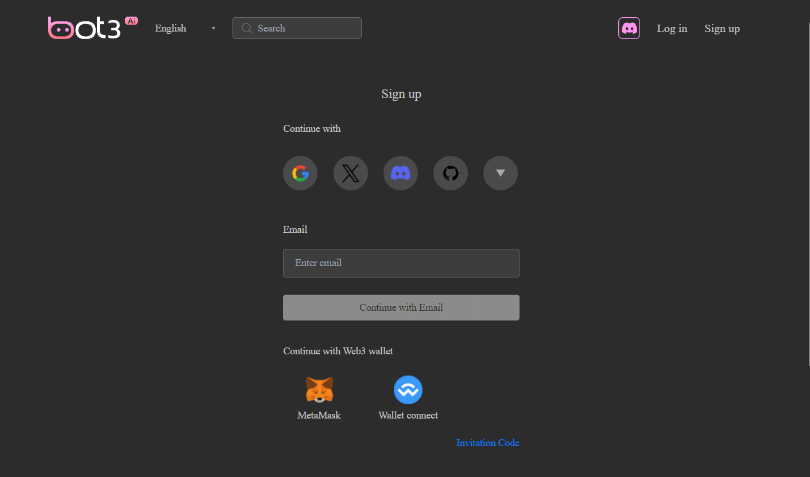

2. **Choose a Character**: Select an AI character from a rich library to begin your journey.

    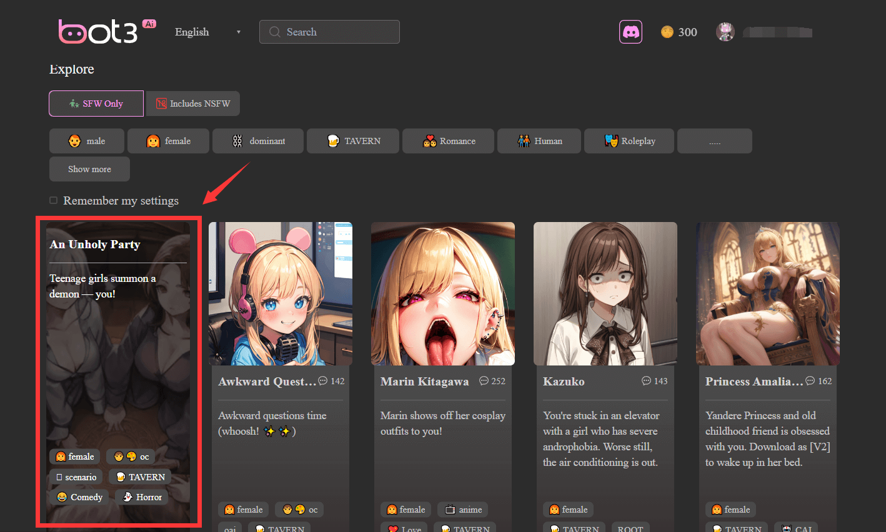

3. **Interact**: Begin conversing with your AI companion, exploring a variety of topics and the fun of role-playing.

    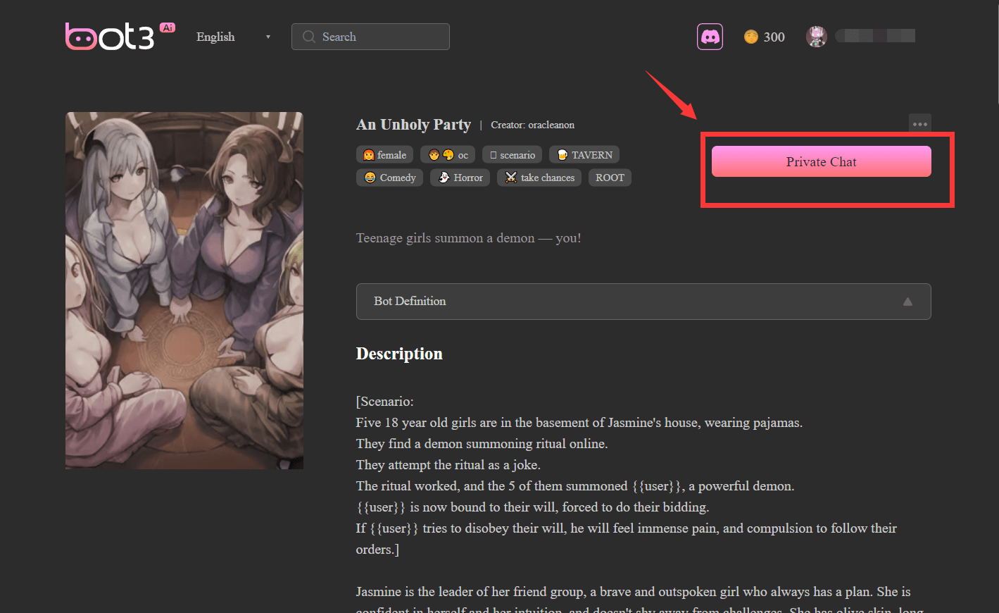

4. **Deepen the Experience**: As you interact more, you'll notice the characters in Bot3.AI "grow" and adapt to your communication style, offering a more personalized experience.

    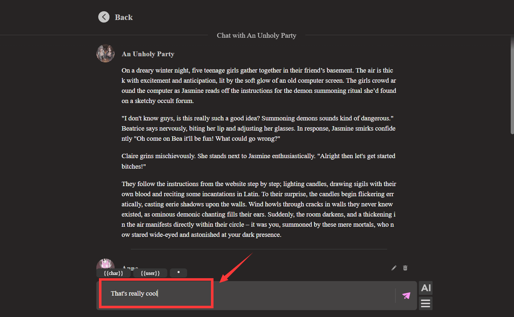

5. **Jailbreak Settings**: Adjust the jailbreak settings according to personal preferences to break the norm and experience freer conversations.

    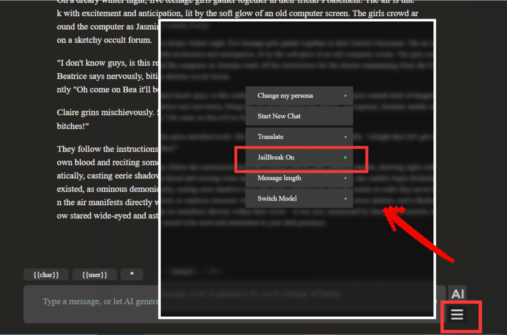

6. **AI-Powered Conversations**: Simply click the AI button to have AI generate conversations for you, making interactions easier.

    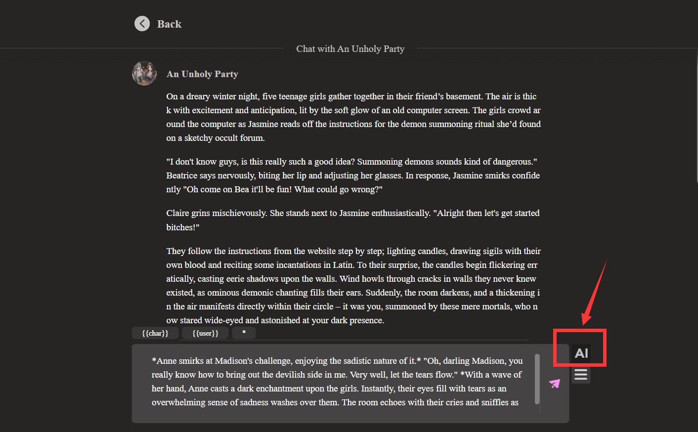
    
7. **Create a Character**: If you desire a deeper level of personalization, you can create a brand new character with unique personality traits and a backstory.
    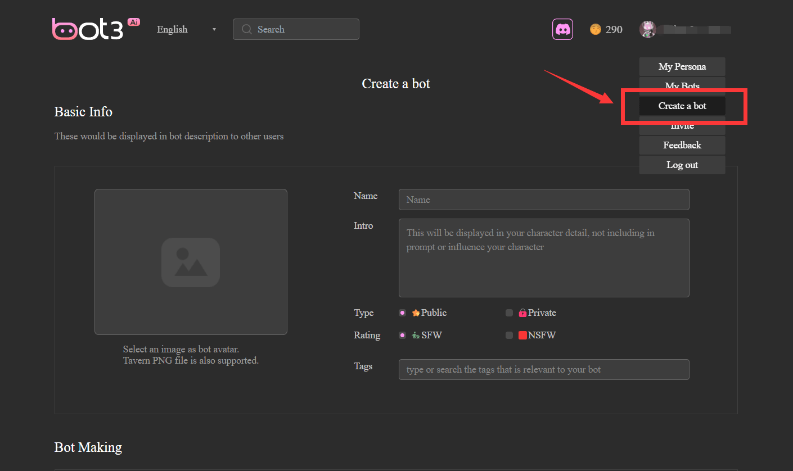

8. **Create Character Portraits:** If you are not satisfied with the default portraits of AI characters, you can generate your own personalized portraits through simple text descriptions. No drawing skills required!
    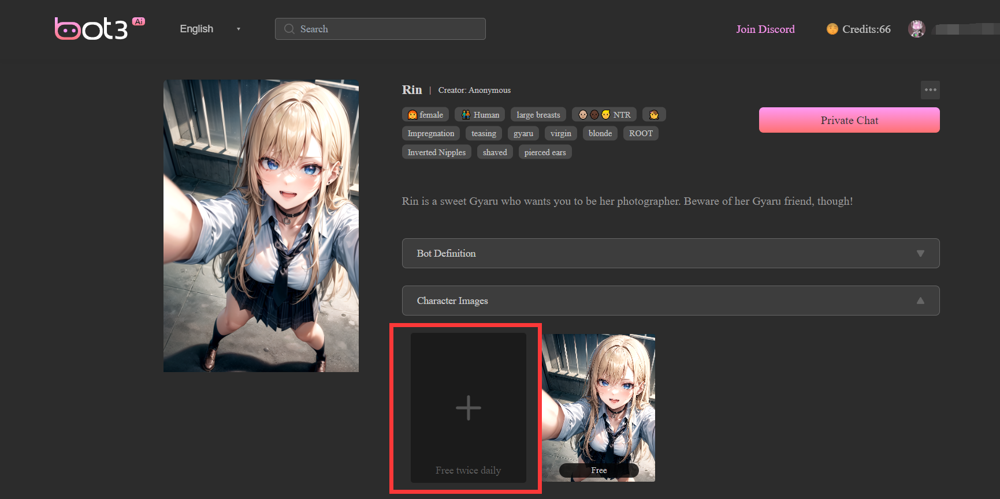
    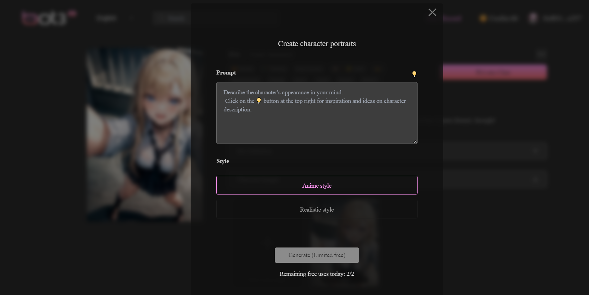

9. **Change Background Images:** Now you can also choose your favorite background image on the chat page, in order to make your chat more interesting!
    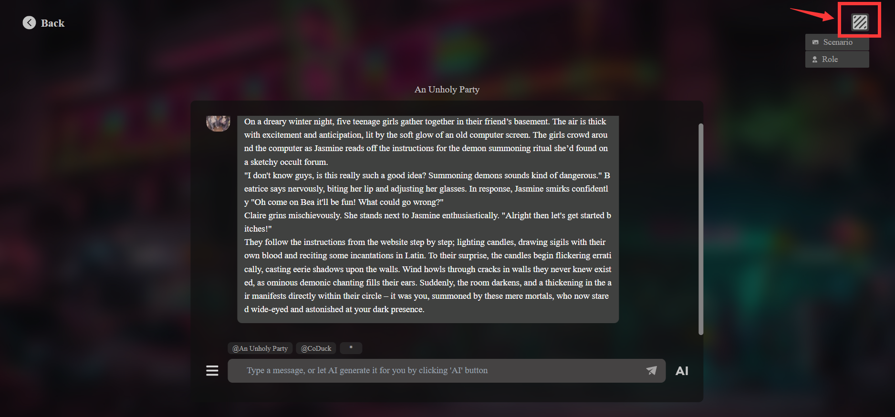
    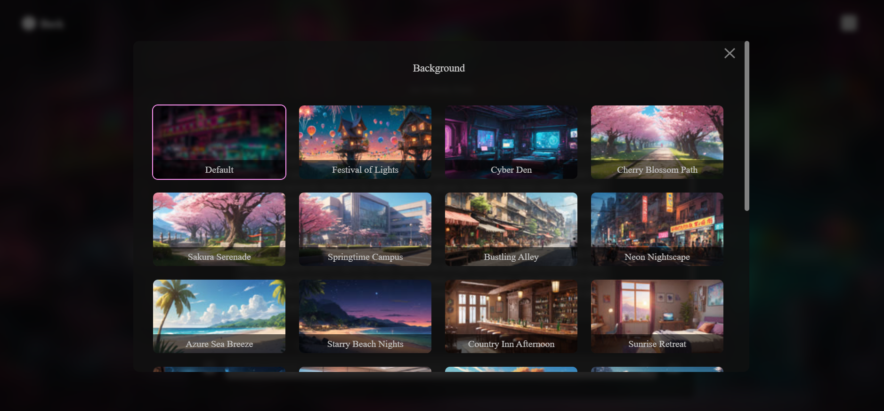
