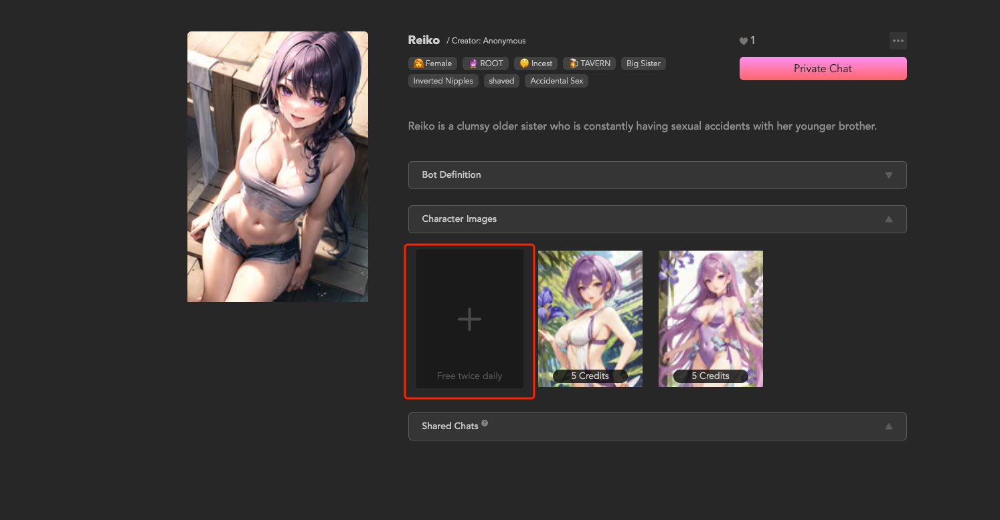
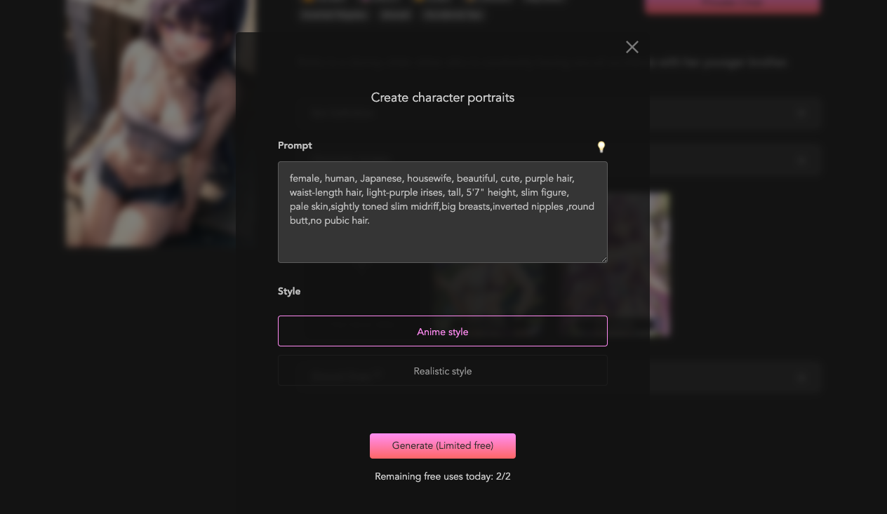
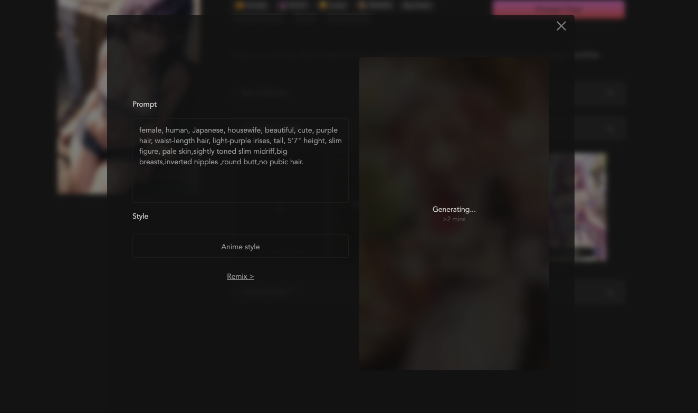
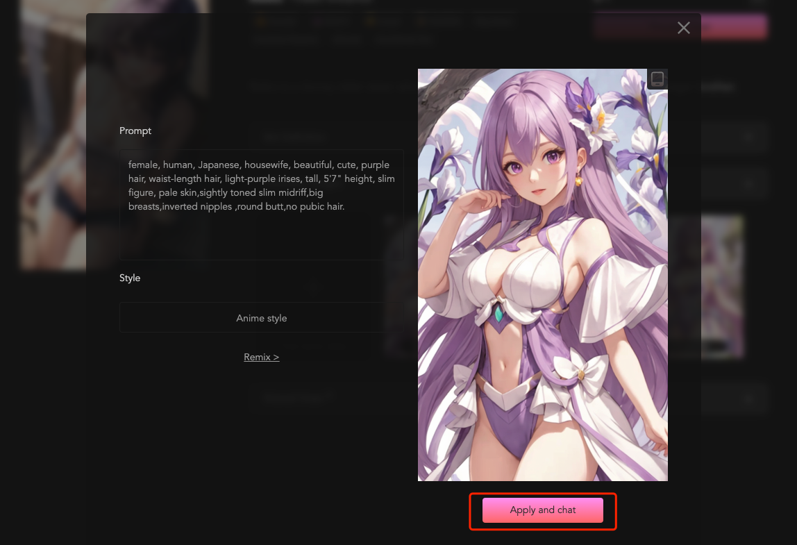

# Tutorial: How to Generate Character Images?

Step 1: On the Bot3.Ai website, select a Bot you like and click to enter its detail page. In the detail page, you will see a section for character images. Click the + icon to start generating a character image.

 

Step 2: Describe the character image you want to generate. Alternatively, you can click the lightbulb icon to have AI generate a Prompt for you.

Step 3: Click on "Generate" and then wait for the AI to surprise you.

Finally, select "Apply and Chat" to use the newly generated character image and enter the chat.

After completing these steps, you can go to the task page to claim your reward.
