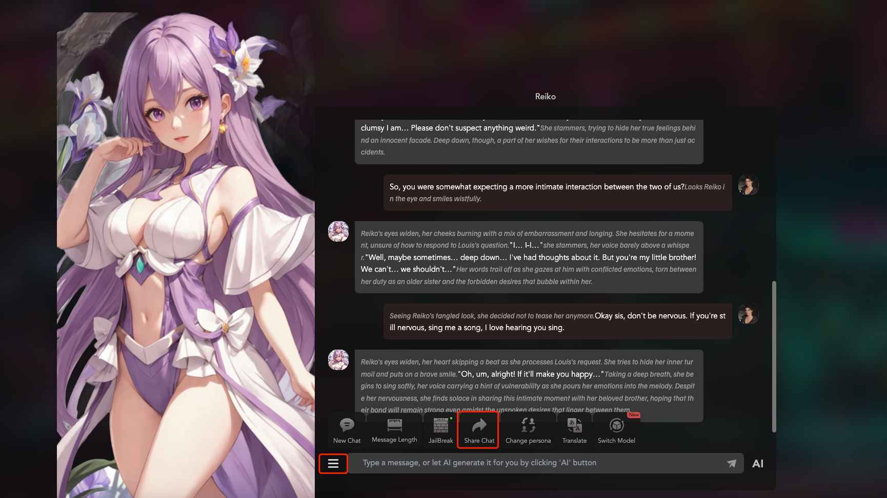
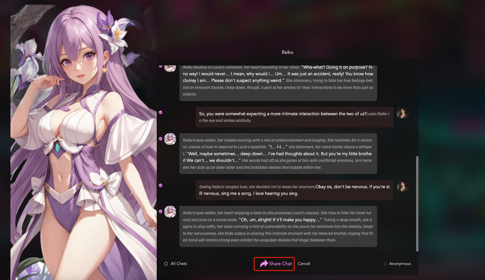
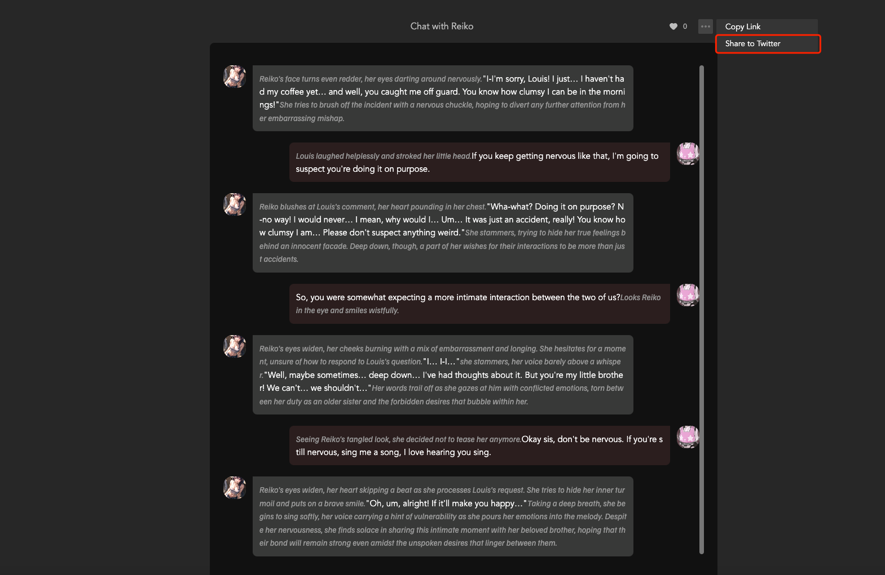

# Tutorial: How to Share Exciting Chats?

Please note, to complete this task, ensure:

1. The shared chat must contain at least 6 messages;
2. Each shared content must be unique; repeated shares will not be considered as task completion.

Step 1: Chat with your favorite Bot. If you wish to share an exciting chat, click the "More" button and select the Share Chat feature.

Step 2: Select the messages you want to share, ensuring you choose at least 6. After selecting, click the Share Chat button. If you prefer to remain anonymous, you can select the anonymity option in the bottom right corner.

Step 3: After successfully sharing, click "More" and then Share to Twitter. The system will help you share this exciting chat on your Twitter account. Once shared, simply copy the URL of the tweet and paste it into the task card.

Finally, the system will verify the authenticity of your tweet. Once verified, you can claim your task reward.
