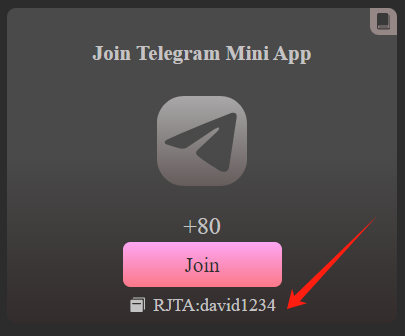
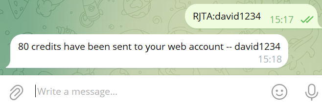

# Tutorial: How to Join Telegram Mini App

**Step 1: Click on "Join" to open the Telegram bot**

The "Join" link will take you to the BOT3 AI's Telegram bot.

**Step 2: Click the command text and send it to the BOT3 AI's Telegram bot**

Click on the text that looks like 'RJTA:{yourusername}' to copy it to your clipboard, where RJTA stands for Rewards for Joining Telegram APP. Then, simply paste it into the [Bot3's Telegram chat box](https://t.me/bot3aibot) and send it. When you receive the message "80 credits have been sent to your web account -- {yourusername}," it means you have completed the task and earned credits for your web account.

